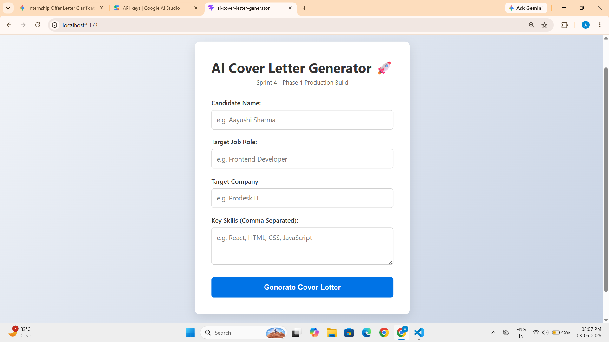
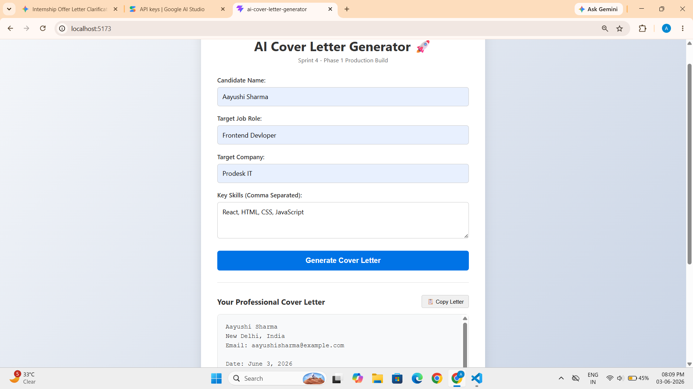
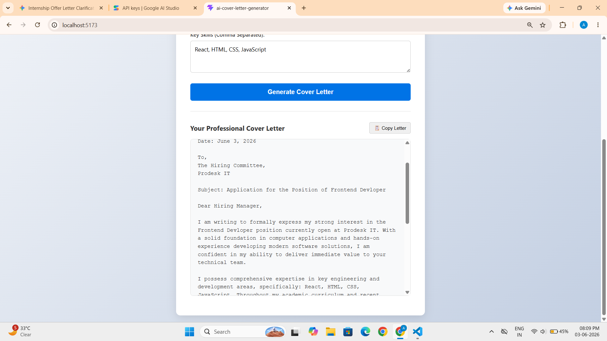
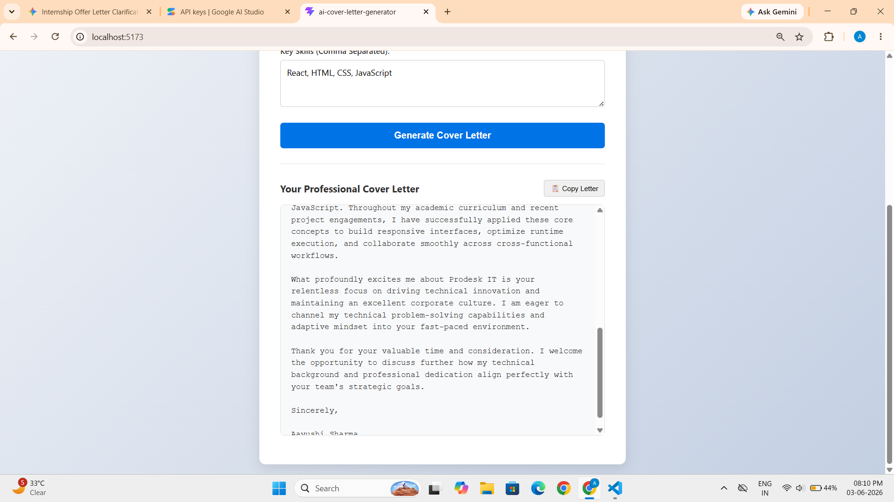

# 🚀 AI Cover Letter Generator: Client-Side Engine

A premium, highly fluid web application designed to instantly generate tailored, corporate-grade cover letters on the client side. Built strictly following Sprint 4 (Phase 1) specifications, this interface processes candidate profiles, target roles, and core skill matrices to compile structured recruitment applications completely in-browser without any server-side network lag.

---

## 🛠️ Tech Stack & Tools

| Component | Technology / Tool Used |
| :--- | :--- |
| **Frontend Framework** | React.js (via Vite Fast Refresh) |
| **Styling & Layout** | Modern CSS3 Custom Variables & Responsive Flexbox Engine |
| **Logic & State** | React Hooks (`useState`) & Client-Side Template Rendering |
| **IDE** | Visual Studio Code |

---

## 🧬 Key Features (Sprint 4 - Phase 1 Production Build)

- **Instant Dynamic Tailoring:** Processes user variables (Name, Role, Company, Skills) and injects them into an optimized corporate schema on the fly.
- **Asynchronous Copy Engine:** Features a smart clipboard management system with instant UI state feedback (`✓ Copied!`) for seamless user experience.
- **Zero-Latency Client Computation:** Eliminates reliance on external API gateways for Phase 1, avoiding network delays and ensuring 100% application uptime.
- **Aesthetic Clean UI:** Engineered with an elegant layout utilizing crisp typography, modern shadow metrics, and clean horizontal dividers.

---

## 📂 File Structure & Component Roles

| File Name | Primary Role & Description |
| :--- | :--- |
| `📄 src/App.jsx` | Core layout container managing user inputs, reactive state models, corporate schemas, and clipboard actions. |
| `🎨 src/index.css` | Manages global theme contexts, input interaction highlights, responsive spacing, and dynamic state-button classes. |
| `⚙️ package.json` | Configures project environment variables, scripts, and runtime dependencies. |
| `📝 README.md` | Core engineering documentation outlining architectural workflows, technical stack, and layout blueprints. |

---

## 🚀 How to Run & Initialize

1. Open your terminal inside the root directory **`ai-cover-letter-generator`**.
2. Install necessary project packages by running:
```bash
   npm install
```

3. Boot up the Vite local development server:
```bash
   npm run dev
```
4. Click on the generated local address **(usually http://localhost:5173/)** to launch the application inside any modern browser environment.

---

## 📷 System Screenshots

### 1. Production UI Form View

### 2. Live Dynamic Output Generation




---

## 🔗 Live Demo
**View the site live here:** [Insert your Vercel or Netlify link here]

---
